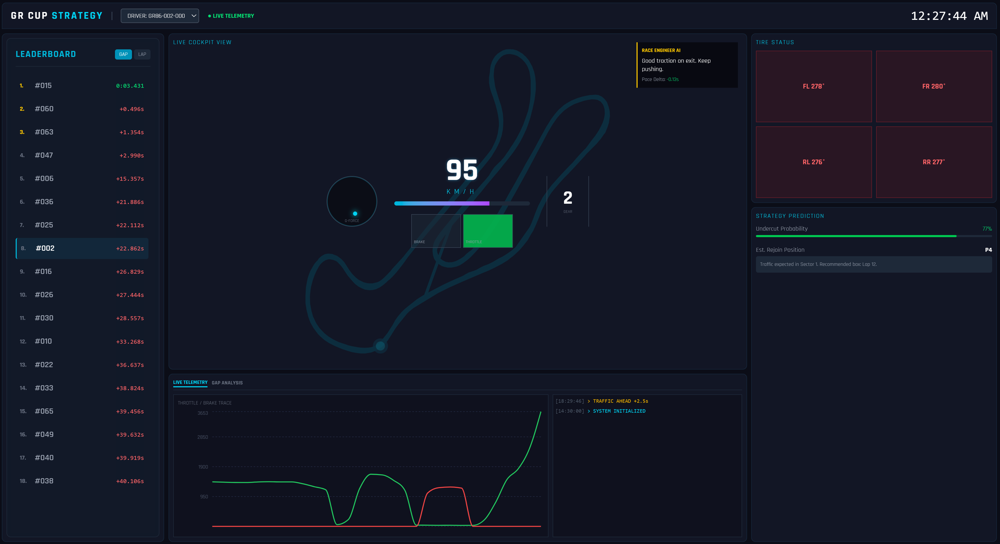

# GR Cup Strategy Dashboard

A real-time, AI-powered race strategy dashboard for the GR Cup, designed with a "Mission Control" aesthetic to help race engineers optimize pace, tire management, and pit strategy.



## Features

*   **Live Telemetry**: Real-time visualization of speed, G-force, throttle/brake traces, and track position.
*   **Race Engineer AI**: Intelligent coaching system that analyzes cornering and tire data to provide actionable feedback (e.g., "Focus on exit speed").
*   **Strategy Terminal**: Predictive "Undercut Probability" and gap analysis trends to determine the optimal pit window.
*   **Dynamic Leaderboard**: Live timing with sector analysis and gap deltas.

## Tech Stack

*   **Frontend**: React, Vite, Tailwind CSS, Recharts
*   **Backend**: FastAPI, Python, Pandas, NumPy, WebSocket

## Getting Started

### Prerequisites

*   Python 3.8+
*   Node.js version 20.19+ or 22.12+
*   npm

### Installation & Running

1.  **Clone the repository:**
    ```bash
    git clone https://github.com/quynhhuongpt/toyota-hackathon
    cd toyota-hackathon
    ```

2.  **Run the startup script:**
    ```bash
    cd backend
    pip install -r requirements.txt
    cd ..
    cd frontend
    npm install
    cd ..
    ./start.sh
    ```
    This script will:
    *   Check for the required dataset in `../barber`. If missing, it will automatically download and unzip it.
    *   Install Python dependencies.
    *   Install Node.js dependencies.
    *   Start both the Backend (FastAPI) and Frontend (Vite) servers.

3.  **Access the Dashboard:**
    Open your browser and navigate to `http://localhost:5173`.

## Data Source

The application uses telemetry data from the **Barber Motorsports Park** dataset. The startup script automatically handles the download from:
`https://trddev.com/hackathon-2025/barber-motorsports-park.zip`

## Credits

*   **React** (Facebook/Meta)
*   **Vite** (Evan You)
*   **Tailwind CSS**
*   **Recharts**
*   **FastAPI** (Tiangolo)
*   **Pandas/NumPy**
